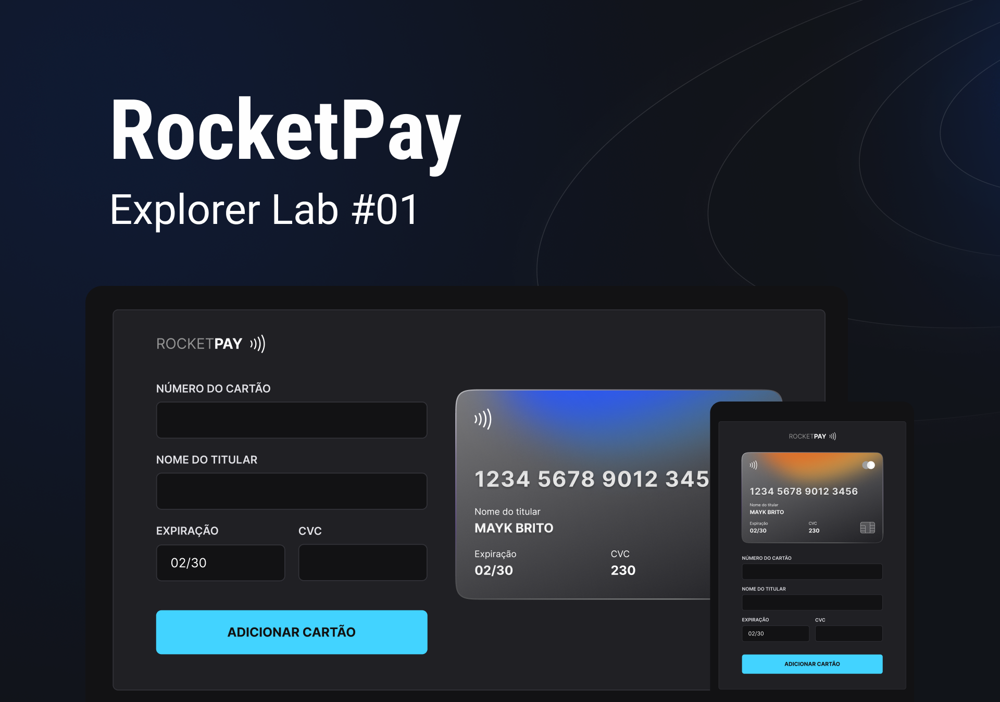

<h1 align="center"> Rocketpay </h1>

<p align="center">
O Rocketpay é um componente que simula o formulário de preenchimento de cartão de crédito. 
</p>

<p align="center">
  
</p>

<p align="center">
  
</p>

<h3 align="center"><a href="https://creditcardcomponentjs.vercel.app/" target="_blank">Projeto ao vivo</a></h3>

### 🚀 Tecnologias

Esse projeto foi desenvolvido com as seguintes tecnologias:

- HTML e CSS
- JavaScript e JSON
- [Node e NPM](https://nodejs.org/)
- [Vite](https://vitejs.dev/)
- [iMask](https://imask.js.org)

### 💻 Executando

Após clonar o repositório, acesse a pasta do projeto e execute os comandos abaixo:

```sh
npm install
npm run dev
```

Acesse http://localhost:5173 para visualizar a aplicação.

### 🔖 Layout

Você pode visualizar o layout do projeto através [DESSE LINK](https://www.figma.com/file/gpqavL469k0pPUGOmAQEM9/Explorer-Lab-%2301/duplicate). É necessário ter conta no [Figma](https://figma.com) para acessá-lo.

### :memo: Licença

Esse projeto está sob a licença MIT.

---

Feito com ♥ by Isadora Aguiar :wave:
